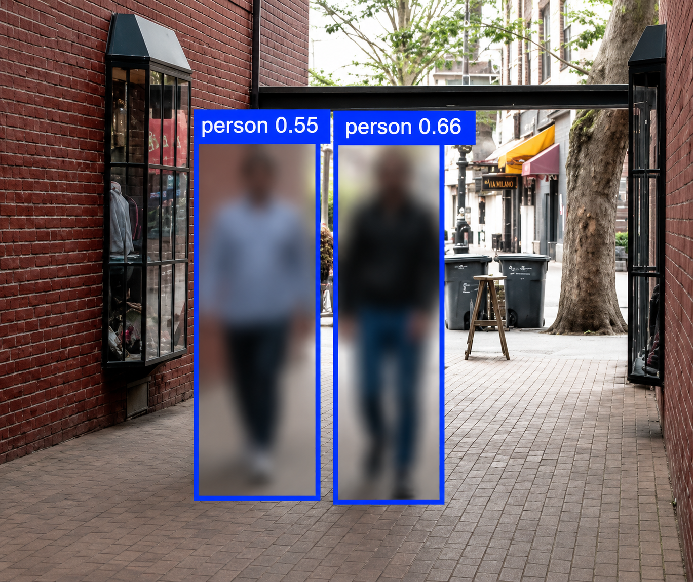

# Person Privacy Blurrer

Automatically blur people in videos to protect privacy — powered by [Ultralytics](https://github.com/ultralytics/ultralytics) `ObjectBlurrer` and YOLO.

Useful for publishing footage of public places (streets, events, storefronts) while keeping bystanders anonymous.

## Demo



*People detected and blurred automatically, frame by frame.*

## Features

- Detects and blurs all people (YOLO class 0) in every frame
- Built-in tracking smooths detections across frames
- Tuned defaults for high recall: low confidence threshold, high-resolution inference, crowd-friendly NMS
- Saves output as a standard `.mp4`
- Two modes: video file processing (`blur_people.py`) and real-time webcam/stream (`blur_webcam.py`)
- Simple CLI — works locally and in Google Colab

## Installation

```bash
git clone https://github.com/YOUR_USERNAME/person-blurrer.git
cd person-blurrer
pip install -r requirements.txt
```

The YOLO weights (`yolo26n.pt`) download automatically on first run.

## Usage

### Video file

```bash
python blur_people.py --source input.mp4 --output output_blur.mp4
```

### Webcam / live stream (real time)

```bash
python blur_webcam.py                     # default webcam
python blur_webcam.py --source 1          # second camera
python blur_webcam.py --record live.mp4   # also save the blurred stream
python blur_webcam.py --source rtsp://... # IP camera / stream URL
```

Press **q** in the preview window to quit. The webcam script defaults to `--imgsz 640` to stay real-time; raise it if your GPU keeps up. It needs a display, so use `blur_people.py` for headless machines or Colab.

### Options

| Flag | Default | Description |
|------|---------|-------------|
| `--source` | (required) | Input video path |
| `--output` | `output_blur.mp4` | Output video path |
| `--model` | `yolo26n.pt` | YOLO weights (use `yolo26s.pt`/`yolo26m.pt` for higher accuracy) |
| `--blur-ratio` | `0.5` | Blur intensity, 0–1 |
| `--conf` | `0.2` | Detection confidence threshold — lower catches more people |
| `--iou` | `0.6` | NMS IoU — higher keeps overlapping people in crowds |
| `--imgsz` | `1280` | Inference resolution — higher detects small/distant people |
| `--show` | off | Live preview window (don't use in Colab) |

### Google Colab

```python
!git clone https://github.com/haroon-aziz/Person-Privacy-Blurrer.git
%cd Person-Privacy-Blurrer
!pip install -r requirements.txt
!python blur_people.py --source /content/my_video.mp4 --output /content/output_blur.mp4
```

If the output doesn't play inline in the notebook, re-encode it for browser playback:

```python
!ffmpeg -y -i /content/output_blur.mp4 -vcodec libx264 /content/output_final.mp4
```

## Tips for best accuracy

- **Low-resolution or distant subjects:** keep `--imgsz 1280` (or higher).
- **Crowded scenes:** keep `--iou 0.6` so close-together people aren't merged.
- **Missed detections:** lower `--conf` to `0.15`, or switch to a larger model (`--model yolo26s.pt`).
- **Too slow:** reduce `--imgsz` to `960` or `640`.

For privacy work, false positives (blurring extra regions) are cheap; missed people are expensive — the defaults are biased accordingly.

## License

MIT — see [LICENSE](LICENSE).

## Acknowledgements

- [Ultralytics YOLO](https://github.com/ultralytics/ultralytics) for detection, tracking, and the `ObjectBlurrer` solution.
